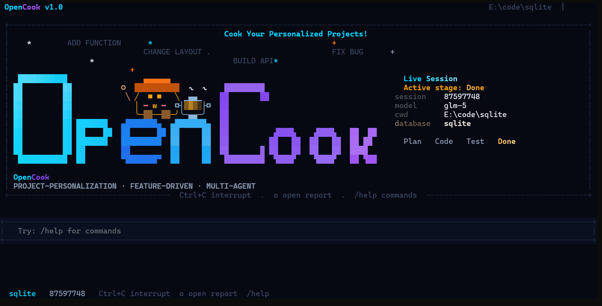

<div align="center">
  <br/>
  <h1>OpenCook</h1>
  <p><b>The External Personalization Layer for Coding Agents</b></p>
  <p><i>Start with a generic project. End with a perfectly tailored solution.</i></p>
</div>

<div align="center">

  [](https://www.python.org/)
  [](LICENSE)
  []()
  []()
  []()

</div>

<div align="center">

  <a href="#-news">News</a> &nbsp;•&nbsp;
  <a href="#-introduction">Introduction</a> &nbsp;•&nbsp;
  <a href="#-demo">Demo</a> &nbsp;•&nbsp;
  <a href="#-quick-start">Quick Start</a> &nbsp;•&nbsp;
  <a href="#-how-it-works">How It Works</a> &nbsp;•&nbsp;
  <a href="#-extend-opencook">Extend</a> &nbsp;•&nbsp;
  <a href="#-comparison">Comparison</a> &nbsp;•&nbsp;
  <a href="#-faq">FAQ</a> &nbsp;•&nbsp;
  <a href="#-citation">Citation</a>

</div>

<div align="center">
  <b>English</b> &nbsp;|&nbsp; <a href="./README_ZH.md">简体中文</a>
  <br/><br/>
  <b>⭐ Star us on GitHub — it motivates us to cook more features!</b>
</div>

---

## 🗞️ News

> - **\[04/2026\]** 🎉 OpenCook **v1.0** is live — the first external personalization layer purpose-built for coding agents. Built-in Recipe library **`oh-my-opencook/`** released. Community recipes are welcome!

---

## ✨ Introduction

Coding agents are powerful but generic. They can navigate your codebase, but they struggle to **deeply** personalize it — injecting a production-ready feature that respects internal conventions, passes the build system, clears regression tests, and ships as a mergeable patch, all without hand-holding.

**OpenCook is the missing layer.** It wraps any coding agent with structured **Recipes**, **Skills**, **Policies**, and **Memory** — giving it the deep project context needed to autonomously deliver precise, production-grade personalizations.

> **Why database functions as the reference case?**  
> Implementing a function at C/C++ source level inside a production database — respecting its memory model, type system, and build infrastructure — is one of the hardest personalization tasks imaginable.

---

## 🎬 Demo

<div align="center">
  <i>👇 Full walkthrough video — <a href="https://vimeo.com/1178451557" target="_blank">watch on Vimeo</a></i>
</div>

<br/>

A live session personalizing SQLite with a new scalar function:

[](https://vimeo.com/1178451557)

---

## 🕹 Quick Start

**Prerequisites:** Python 3.10+, an LLM API key, and the source tree of your target project.

### Step 1 — Install

```bash
git clone https://github.com/weAIDB/OpenCook.git && cd OpenCook
conda create -n opencook python=3.10 -y && conda activate opencook
pip install -r requirements.txt
```

### Step 2 — Configure

```bash
cp code_config.yaml.example code_config.yaml   # then edit with your settings
```

```yaml
# code_config.yaml (minimal)
databases:
    default: sqlite
    sqlite:
        install_folder: /path/to/sqlite/source

model_providers:
    anthropic:
        api_key: sk-ant-...

models:
    code_agent_model:
        model_provider: anthropic
        model: claude-sonnet-4-6
        temperature: 0.0
```

### Step 3 — Cook

```bash
# Interactive TUI (recommended)
python -m code_agent.cli chat

# Headless single task
python agent_main.py --task "Implement the BOOL_AND aggregate function for SQLite"

# Target a specific database
python agent_main.py --db postgresql --task "Implement the SINH scalar function"
```

---

## 📚 Features

<table>
<tr>
<td width="50%">

**🧩 Project-Local Personalization**  
Walk-up recipe roots and per-project policies. Every agent knows the local rules before writing a single line.

</td>
<td width="50%">

**🔄 Built-in Delivery Loop**  
Fixed Plan → Code → Test cycle with self-correcting subagents. Iterates until the patch compiles and tests pass.

</td>
</tr>
<tr>
<td>

**🧠 4-Layer Memory Stack**  
Working → Episodic → Project → Long-Term. Agents stay coherent across hours-long personalization sessions.

</td>
<td>

**📖 Dynamic Recipe System**  
Drop a `RECIPE.md` anywhere on the discovery path. Auto-loaded at runtime, injected at the right agent stage.

</td>
</tr>
<tr>
<td>

**🔎 Context-Aware Injection**  
Understands cross-unit dependencies and build conventions. Features land exactly where they belong.

</td>
<td>

**📋 Patch-Oriented Traceability**  
Every run emits a trajectory record, a file diff, and a structured report. Full reproducibility out of the box.

</td>
</tr>
</table>

---

## 🏗️ How It Works

OpenCook runs a deterministic **Plan → Code → Test** pipeline through three specialized agents:

| Agent | Role | Key Behavior |
|---|---|---|
| **CodeAgent** | Orchestrator | Writes code, coordinates sub-agents, self-corrects on failure |
| **PlanAgent** | Read-only Scoper | Decomposes the task; locates files, entry points, and conventions |
| **TestAgent** | Validator | Compiles, runs test suite, reports failures back to CodeAgent |

---

## 🗄️ Reference Case: Database Functions

The reference benchmark — the domain hardest to automate correctly, and thus the strongest proof of the personalization thesis.

| Database | Language | Entry Point |
|---|---|---|
| **SQLite** | C | `FuncDef aBuiltinFunc[]` in `func.c` |
| **PostgreSQL** | C | `builtins.h` + `.c` implementation |
| **DuckDB** | C++ | `ScalarFunctionSet` / `FunctionFactory` |
| **ClickHouse** | C++ | `FunctionFactory::instance().registerFunction<>()` |

> The same Plan → Code → Test loop applies to any codebase domain. Database engines are just the hardest kitchen to cook in.

---

## 🔌 Compatibility

**Works alongside any coding agent**

| Agent | Integration Path |
|---|---|
| Claude Code | Recipes via `CLAUDE.md` or skills path |
| Codex | `AGENTS.md` context + MCP |
| OpenCode / OpenClaw | Plugin package path |
| TRAE | Project-local context |
| Any agent | Serialize recipes into the system prompt |

**Supports any LLM provider**

| Provider | Example Models |
|---|---|
| Anthropic | Claude Sonnet 4.6, Claude Opus 4.6 |
| OpenAI | GPT-4o, GPT-5 |
| Google | Gemini 2.5 Pro |
| DeepSeek | DeepSeek-V3, DeepSeek-Coder |
| Zhipu / Qwen / DouBao | GLM-5, Qwen3-Coder |
| Azure / OpenRouter | Any deployed endpoint |
| Ollama | Any local model — fully offline |

Each agent role (Plan / Code / Test) can use a **different model and provider** independently.

---

## 🔪 Extend OpenCook

### Write a Recipe

```
.opencook/recipes/
└── my-feature-recipe/
    ├── RECIPE.md       ← trigger · context · steps
    └── references/     ← optional supporting docs
```

```markdown
---
name: my-feature-recipe
description: Teaches agents how to implement X in codebase Y
triggers: [implement X, add X feature]
---

## Context
[Conventions, pitfalls, and patterns the agent must know]

## Steps
1. Locate the entry point by searching for ...
2. Follow the registration pattern at ...
3. Verify with ...
```

### Add a new domain

| Step | What to implement |
|---|---|
| 1 | **Template** — code scaffolding for the target language/framework |
| 2 | **Test harness** — domain-specific build and execution runner |
| 3 | **Extraction utils** — symbol/schema extraction helpers |
| 4 | **Recipes** — domain knowledge in `RECIPE.md` files |

### Add an LLM provider

Implement `BaseClient` in `code_agent/utils/llm_clients/` and register it in `LLMClient`. No other changes needed.

---

## 🆚 Comparison

How OpenCook stands apart on the surfaces that matter most to its personalization thesis.

| Surface | **OpenCook** | Claude Code | Codex | OpenCode | OpenClaw |
|---|:---:|:---:|:---:|:---:|:---:|
| Project-Local Personalization Path | ✦ | ✦ | ~ | ✦ | ✦ |
| Built-In Delivery Loop (Plan→Code→Test) | ✦ | ~ | ~ | ~ | ~ |
| Explicit Multi-Layer Memory | ✦ | ~ | ~ | ~ | ~ |
| Patch-Oriented Traceability | ✦ | ~ | ~ | ~ | ~ |
| In-Tree Domain Scaffolding | ✦ | ✗ | ✗ | ✗ | ✗ |

<sub>✦ Clearly present &nbsp; ~ Present but narrower &nbsp; ✗ Not observed in inspected source</sub>

---

## 🤔 FAQ

<details>
<summary><b>Is OpenCook only for databases?</b></summary>
<br/>
No. Database function implementation is the reference benchmark — it demands deep C/C++ internals knowledge, making it the hardest test of our personalization thesis. The Plan → Code → Test loop and recipe system are fully domain-agnostic. We are actively expanding to other codebase domains.
</details>

<details>
<summary><b>How is this different from just prompting Claude Code or Codex?</b></summary>
<br/>
A generic prompt gives breadth, not depth. OpenCook's recipe system encodes the <em>exact</em> project conventions, registration patterns, pitfalls, and verification steps for your domain. Combined with a fixed delivery loop and multi-layer memory, the agent is far less likely to hallucinate conventions or leave the patch broken.
</details>

<details>
<summary><b>Which LLM gives the best results?</b></summary>
<br/>
For complex C/C++ internals: Claude Sonnet/Opus and GPT-4o class models. For cost-effective alternatives: DeepSeek-Coder and Qwen3-Coder. Models below ~32B may struggle with deep project conventions.
</details>

<details>
<summary><b>Do I need Docker?</b></summary>
<br/>
Optional but recommended. Without it, TestAgent compiles on the host. With it, every compile-test cycle runs in an isolated container — fully reproducible.
</details>

<details>
<summary><b>How does the self-correction loop work?</b></summary>
<br/>
TestAgent captures compiler output and test failures as structured tool results and feeds them back to CodeAgent. CodeAgent patches iteratively until all checks pass or the step budget is exhausted.
</details>

---

## 📋 Roadmap

- [ ] **Open Benchmark** — public leaderboard of personalization tasks across databases and domains
- [ ] **Broader Domain Support** — kernel modules, language runtimes, compiler backends
- [ ] **Parallel Cooking** — concurrent PlanAgent/TestAgent pairs for batch personalization
- [ ] **Web UI** — browser-based session dashboard
- [ ] **Fine-Tuned Models** — domain-specific models trained on successful trajectories
- [ ] **MCP Server** — expose the recipe + memory system as an MCP endpoint for any agent

---

## 👫 Community

We welcome contributions of all kinds — new recipes, domain backends, LLM clients, bug reports, and ideas.

- **GitHub**: [github.com/weAIDB/OpenCook](https://github.com/weAIDB/OpenCook)
- **Issues / PRs**: open an issue or pull request
- **Discussions**: [GitHub Discussions](https://github.com/weAIDB/OpenCook/discussions)

---

## 📒 Citation

```bibtex
@misc{opencook2026,
  author       = {Wei Zhou and others},
  title        = {OpenCook: An External Personalization Layer for Coding Agents},
  year         = {2026},
  howpublished = {\url{https://github.com/weAIDB/OpenCook}}
}
```

---

## 📝 License

MIT License — see [LICENSE](LICENSE) for details.
